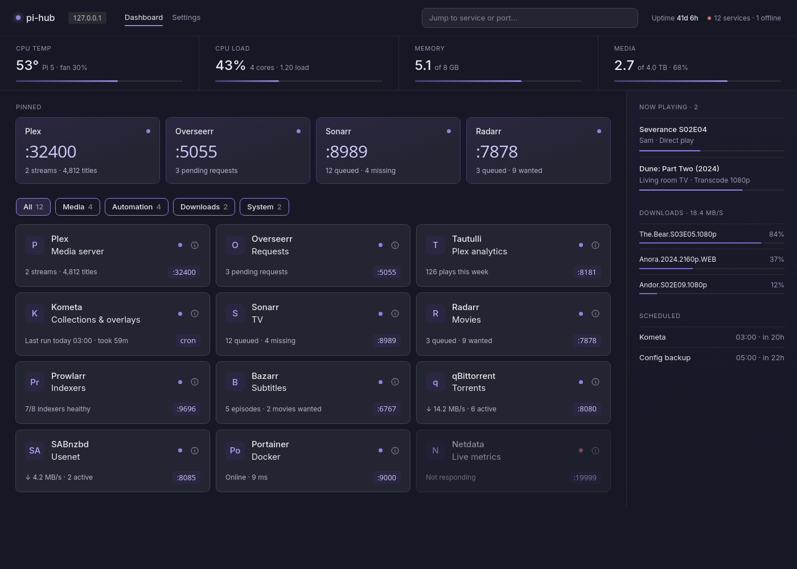
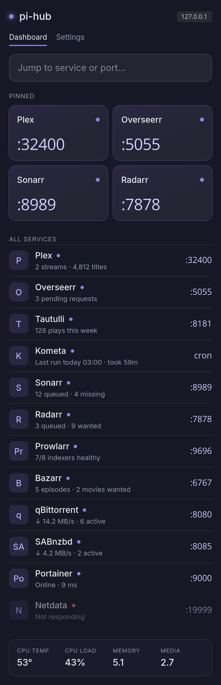

# pi-hub

A tiny launcher and status dashboard for the self-hosted services on your home server — built for a Raspberry Pi, happy anywhere Docker or Python runs.

Stop remembering port numbers. pi-hub shows every service as a card with a live status line, a big port number and one-click links, plus the things you glance at most: CPU temperature, disk space, what's playing on Plex, what's downloading, and when your scheduled jobs run next.



- **Zero dependencies.** Python standard library only — no `pip install`, no database, no build step. The Docker image is about 75 MB.
- **Live status for popular apps:** Plex, Sonarr, Radarr, Prowlarr, Bazarr, qBittorrent, SABnzbd and Kometa — and an up/down check with response times for *any* web app.
- **Jump to anything:** type a name or port, press <kbd>Enter</kbd>. <kbd>/</kbd> focuses search from anywhere.
- **Details on demand:** uptime, version, current response time and a 24-hour response-time chart for each service.
- **Phone-friendly:** a launcher-first layout on small screens.
- **Edit in the browser** or in a plain `config.json`. API keys are write-only in the UI and can come from environment variables or Docker secrets.

<p align="center"></p>

## Quick start (Docker)

```sh
mkdir -p pi-hub/config && cd pi-hub
curl -fsSLO https://raw.githubusercontent.com/newtonmunene99/pi-hub/main/compose.example.yml
curl -fsSL -o config/config.json https://raw.githubusercontent.com/newtonmunene99/pi-hub/main/config.example.json
mv compose.example.yml compose.yml
# edit config/config.json (your services) and compose.yml (disks, API keys, timezone)
docker compose up -d
```

Open `http://<your-server>:8000`.

The container runs as UID 1000 — make sure it can write `config/` (`sudo chown -R 1000 config`).

### Without Docker

Python 3.10 or newer:

```sh
git clone https://github.com/newtonmunene99/pi-hub && cd pi-hub
cp config.example.json config.json   # then edit it
PIHUB_CONFIG=./config.json python3 -m pihub
```

### Just looking?

`PIHUB_DEMO=1 python3 -m pihub` (or `docker run --rm -p 8000:8000 -e PIHUB_DEMO=1 ghcr.io/newtonmunene99/pi-hub`) serves realistic fake data, no config needed.

## Configuration

Everything lives in one `config.json`. The full reference is in **[docs/configuration.md](docs/configuration.md)**; the short version:

```json
{
  "system": { "disks": [{ "name": "media", "path": "/disks/media" }] },
  "schedule": [{ "name": "Kometa", "at": "03:00", "service": "kometa" }],
  "services": [
    { "name": "Radarr", "kind": "radarr", "port": "7878", "category": "Automation", "pinned": true,
      "apiKey": "env:RADARR_API_KEY" },
    { "name": "Home Assistant", "port": "8123", "category": "System" }
  ]
}
```

| Supported `kind` | Card shows |
|---|---|
| `plex` | streams and library size; *Now playing* sidebar |
| `sonarr` / `radarr` | queued and missing/wanted counts |
| `prowlarr` | healthy indexers |
| `bazarr` | wanted subtitles |
| `qbittorrent` / `sabnzbd` | speed and active downloads; *Downloads* sidebar |
| `kometa` | last run and duration (from its log file) |
| `generic` (default) | online/offline and response time — works for anything |

Want another app? See [adding an integration](CONTRIBUTING.md#adding-an-integration) — it's usually ~20 lines.

### Environment variables

| Variable | Default | |
|---|---|---|
| `PIHUB_CONFIG` | `/config/config.json` | config file path |
| `PIHUB_PORT` | `8000` | listen port |
| `PIHUB_HOST` | `0.0.0.0` | bind address |
| `PIHUB_PASSWORD` | — | require a password for the settings page |
| `PIHUB_READONLY` | — | `1` disables editing in the UI |
| `PIHUB_DEMO` | — | `1` serves fake data |
| `TZ` | `UTC` | timezone for the schedule |

## Security

pi-hub is meant for your home network. It has no user accounts: anyone who can reach it can see the dashboard. If you expose it beyond your LAN, put it behind a reverse proxy with authentication.

- API keys are never sent to the browser. In the settings page they're write-only.
- If a service's host, port, scheme, base path or kind changes, its stored keys are dropped, so they can't be redirected to another machine.
- `PIHUB_PASSWORD` protects the settings page; `PIHUB_READONLY=1` removes editing completely.
- Strict Content-Security-Policy, no third-party requests (fonts are bundled).

Found a vulnerability? Please follow [SECURITY.md](SECURITY.md).

## Contributing

Bug reports, integrations and design improvements are very welcome — see [CONTRIBUTING.md](CONTRIBUTING.md). The project follows the [Contributor Covenant](CODE_OF_CONDUCT.md).

## License

[MIT](LICENSE). The bundled Inter font is under the [SIL Open Font License](pihub/static/fonts/OFL.txt).
